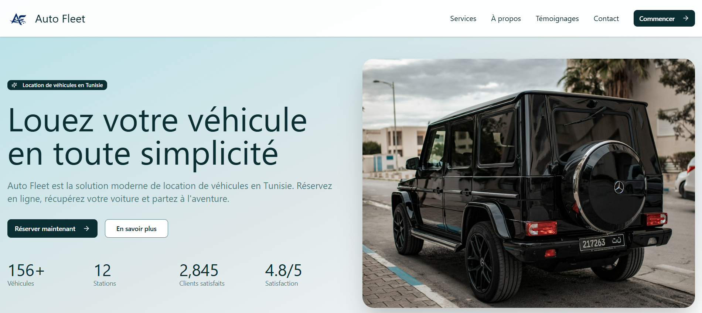
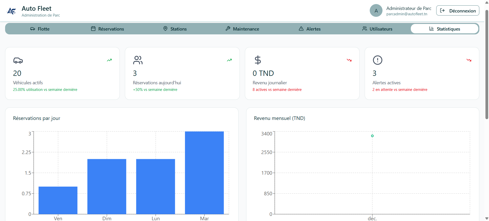

# 🏗️ Auto Fleet - System Architecture

<div align="center">


**Modern Car Rental Management System Architecture**

</div>

---

## 📋 Overview

Auto Fleet is a modern car rental management system built with a clean separation between frontend and backend, following industry best practices for maintainability and scalability.

### 🎯 Architecture Principles

- **Separation of Concerns** - Clear boundaries between layers
- **Scalability** - Designed to grow with your business
- **Security First** - Built-in authentication and authorization
- **Modern Stack** - Latest technologies and best practices

### 🖼️ Application Screenshots

<table>
<tr>
<td width="50%">

**Home Page**


</td>
<td width="50%">

**Admin Fleet Management**


</td>
</tr>
</table>

## 📁 Project Structure

```
WEB-SUPCOM-Project/
│
├── backend/                         # Backend (API)
│   ├── src/                         # Backend source code (Express)
│   │   ├── routes/                 # API route handlers
│   │   ├── middleware/             # Express middleware (auth, validation)
│   │   ├── server.ts               # Express server setup
│   │   └── index.ts                # Application entry point
│   ├── prisma/                      # Prisma schema & database
│   │   ├── schema.prisma           # Database schema definition
│   │   └── seed.ts                 # Database seeding script
│   ├── package.json                # Backend dependencies
│   └── README.md                   # Backend documentation
│
├── src/                             # Frontend (React – single app)
│   ├── components/                 # UI components
│   │   ├── admin/                  # Admin dashboard components
│   │   ├── client/                 # Client dashboard components
│   │   ├── direction/              # Direction dashboard components
│   │   ├── auth/                   # Authentication components
│   │   ├── ui/                     # Shared UI components (buttons, cards, etc.)
│   │   └── *.tsx                   # Shared components
│   ├── contexts/                   # React Contexts
│   │   └── AuthContext.tsx         # Authentication state management
│   ├── services/                   # API services
│   │   └── api.ts                  # API client and requests
│   ├── assets/                     # Static assets (images, icons)
│   ├── styles/                     # Global styles
│   ├── App.tsx                     # Root application component
│   ├── main.tsx                    # React application entry point
│   └── README.md                   # Frontend documentation
│
├── Documentation/                  # Project documentation
│   ├── INDEX.md                    # Navigation / table of contents
│   ├── ARCHITECTURE.md             # This file - System architecture
│   ├── README.md                   # Main documentation guide
│   ├── architecture_frontend.md    # Frontend architecture details
│   ├── figma_import_steps.md       # Design import workflow
│   ├── justification_du_choix_du_theme.md  # Theme selection
│   ├── README_DEVELOPMENT.md       # Development setup guide
│   ├── Guidelines.md               # Coding guidelines
│   └── Attributions.md             # Credits and attributions
│
├── Configuration/                  # Configuration guide
│   └── README.md                   # Guide to all configuration files
│
├── index.html                      # Vite HTML entry point
├── package.json                    # Frontend dependencies & scripts
├── vite.config.ts                  # Vite build configuration
└── README.md                       # Global project overview
```

## 🎯 Architecture Principles

### 1. Separation of Concerns
- **Frontend**: Pure React application focused on UI/UX
- **Backend**: RESTful API handling business logic and data
- **Configuration**: Centralized configuration management
- **Documentation**: Standalone, comprehensive documentation

### 2. Modularity
- Components organized by feature and role (admin, client, direction)
- Shared UI components in `/src/components/ui`
- Reusable services for API communication

### 3. Scalability
- Role-based architecture allowing easy addition of new user types
- Modular component structure for feature expansion
- Prisma ORM for flexible database schema evolution

## 🔧 Technology Stack

### Frontend Technologies

| Technology | Version | Purpose |
|------------|---------|---------|
| **React** | 18.3.1 | Core UI framework with hooks and context |
| **TypeScript** | Latest | Type-safe development |
| **Vite** | Latest | Ultra-fast build tool and dev server |
| **Tailwind CSS** | Latest | Utility-first CSS framework |
| **Radix UI** | Latest | 30+ accessible component primitives |
| **Recharts** | 2.15.2 | Data visualization and charts |
| **React Hook Form** | 7.55.0 | Form state management |
| **Lucide React** | 0.487.0 | Modern icon library (500+ icons) |
| **Sonner** | 2.0.3 | Toast notifications |
| **date-fns** | Latest | Date manipulation library |
| **Embla Carousel** | 8.6.0 | Carousel functionality |
| **class-variance-authority** | 0.7.1 | Variant-based styling |

### Backend Technologies

| Technology | Version | Purpose |
|------------|---------|---------|
| **Node.js** | 18+ | JavaScript runtime environment |
| **Express** | 4.21.2 | Minimalist web framework |
| **TypeScript** | 5.7.2 | Type-safe backend development |
| **Prisma** | 6.19.1 | Next-generation ORM |
| **PostgreSQL** | 14+ | Relational database |
| **JWT** | 9.0.2 | JSON Web Token authentication |
| **Bcrypt** | 6.0.0 | Password hashing (10 rounds) |
| **Zod** | 3.24.1 | Schema validation |
| **CORS** | 2.8.5 | Cross-origin resource sharing |
| **dotenv** | 16.4.7 | Environment configuration |

### Development Tools

- **tsx** (4.19.2) - TypeScript execution for development
- **pg** (8.16.3) - PostgreSQL client
- **Prisma Studio** - Visual database editor

## 🔐 Authentication Flow

```
User Login
    ↓
Credentials Validation (Backend)
    ↓
JWT Token Generation
    ↓
Token Storage (Frontend - AuthContext)
    ↓
Protected Routes Access
    ↓
Role-Based Component Rendering
```

### Roles:
1. **Client**: Book vehicles, view rentals, report incidents
2. **Admin**: Manage fleet, bookings, maintenance, users
3. **Direction**: View analytics, reports, KPIs

## 🗄️ Database Schema (Prisma)

### Complete Data Models

#### User Model
```prisma
model User {
  id        String   @id @default(uuid())
  email     String   @unique
  password  String   // Bcrypt hashed
  name      String
  phone     String?
  address   String?
  role      UserRole @default(CLIENT)
  createdAt DateTime @default(now())
  updatedAt DateTime @updatedAt

  bookings      Booking[]
  notifications Notification[]
  incidents     Incident[]
}

enum UserRole {
  CLIENT      // Can book vehicles and report incidents
  ADMIN       // Full system management
  DIRECTION   // Analytics and reporting access
}
```

#### Vehicle Model
```prisma
model Vehicle {
  id           String        @id @default(uuid())
  brand        String        // e.g., "Toyota", "Renault"
  model        String        // e.g., "Corolla", "Clio"
  year         Int
  category     String        // e.g., "Economy", "SUV", "Luxury"
  licensePlate String        @unique
  color        String?
  seats        Int
  transmission String        // "Manual" or "Automatic"
  fuelType     String        // "Petrol", "Diesel", "Electric", "Hybrid"
  imageUrl     String?
  status       VehicleStatus @default(AVAILABLE)
  mileage      Int           @default(0)
  price        Float         @default(0)  // Daily rental price
  stationId    String
  createdAt    DateTime      @default(now())
  updatedAt    DateTime      @updatedAt

  station      Station        @relation(fields: [stationId], references: [id])
  bookings     Booking[]
  maintenances Maintenance[]
}

enum VehicleStatus {
  AVAILABLE      // Ready to rent
  RENTED         // Currently rented
  MAINTENANCE    // Under maintenance
  OUT_OF_SERVICE // Not available
}
```

#### Station Model
```prisma
model Station {
  id              String   @id @default(uuid())
  name            String
  city            String
  address         String
  phone           String
  email           String?
  latitude        Float?
  longitude       Float?
  capacity        Int      @default(20)
  availablePlaces Int      @default(20)
  openingHours    String   @default(\"08:00 - 20:00\")
  isOpen          Boolean  @default(true)
  createdAt       DateTime @default(now())
  updatedAt       DateTime @updatedAt

  vehicles Vehicle[]
  bookings Booking[]
}
```

#### Booking Model
```prisma
model Booking {
  id              String        @id @default(uuid())
  userId          String
  vehicleId       String
  stationId       String
  startDate       DateTime
  endDate         DateTime
  totalPrice      Float
  status          BookingStatus @default(PENDING)
  pickupLocation  String?
  dropoffLocation String?
  notes           String?
  createdAt       DateTime      @default(now())
  updatedAt       DateTime      @updatedAt

  user      User       @relation(fields: [userId], references: [id])
  vehicle   Vehicle    @relation(fields: [vehicleId], references: [id])
  station   Station    @relation(fields: [stationId], references: [id])
  incidents Incident[]
}

enum BookingStatus {
  PENDING    // Awaiting confirmation
  CONFIRMED  // Confirmed by admin
  ACTIVE     // Rental in progress
  COMPLETED  // Rental finished
  CANCELLED  // Booking cancelled
}
```

#### Maintenance Model
```prisma
model Maintenance {
  id          String    @id @default(uuid())
  vehicleId   String
  type        String    // \"ROUTINE\", \"REPAIR\", \"INSPECTION\", \"EMERGENCY\"
  description String
  cost        Float?
  scheduledAt DateTime
  completedAt DateTime?
  notes       String?
  createdAt   DateTime  @default(now())
  updatedAt   DateTime  @updatedAt

  vehicle Vehicle @relation(fields: [vehicleId], references: [id])
}
```

#### Incident Model
```prisma
model Incident {
  id          String         @id @default(uuid())
  userId      String
  bookingId   String
  description String
  severity    String         // \"LOW\", \"MEDIUM\", \"HIGH\", \"CRITICAL\"
  status      IncidentStatus @default(PENDING)
  createdAt   DateTime       @default(now())
  updatedAt   DateTime       @updatedAt

  user    User    @relation(fields: [userId], references: [id])
  booking Booking @relation(fields: [bookingId], references: [id])
}

enum IncidentStatus {
  PENDING     // Awaiting review
  IN_PROGRESS // Being addressed
  RESOLVED    // Issue fixed
  REJECTED    // Invalid incident
}
```

#### Notification Model
```prisma
model Notification {
  id        String   @id @default(uuid())
  userId    String
  title     String
  message   String
  read      Boolean  @default(false)
  type      String?  // \"BOOKING\", \"MAINTENANCE\", \"INCIDENT\", \"SYSTEM\"
  createdAt DateTime @default(now())

  user User @relation(fields: [userId], references: [id])
}
```

### Database Relationships Diagram

```
User (1) ───────────(N) Booking
                     │
Vehicle (1) ─────────┤
                     │
Station (1) ─────────┘

Booking (1) ────────(N) Incident
User (1) ───────────┘

Vehicle (1) ────────(N) Maintenance

User (1) ───────────(N) Notification
```

## 🌐 API Architecture

### Complete API Endpoints Reference

#### Authentication (`/api/auth`)
- `POST /register` - User registration (creates CLIENT by default)
  - Body: `{ email, password, name, phone?, address? }`
  - Returns: `{ token, user: { id, email, name, role } }`
- `POST /login` - User authentication
  - Body: `{ email, password }`
  - Returns: `{ token, user: { id, email, name, phone, address, role } }`

**JWT Token Format:**
```json
{
  "id": "user-uuid",
  "email": "user@example.com",
  "role": "CLIENT|ADMIN|DIRECTION",
  "iat": 1234567890,
  "exp": 1235172690
}
```

#### Vehicles (`/api/vehicles`)
- `GET /` - List vehicles with advanced filters
  - Query params: 
    - `status` - Filter by vehicle status
    - `category` - Filter by category (Economy, SUV, Luxury)
    - `stationId` - Filter by station
    - `city` - Filter by city
    - `startDate`, `endDate` - Check availability in date range
    - `type` - Filter by type
    - `available` - Boolean for available only
  - Returns: Array of vehicles with station details
- `GET /:id` - Get vehicle details
  - Returns: Vehicle with station, bookings count, maintenance history
- `POST /` - Create vehicle (Admin only)
  - Body: `{ brand, model, year, category, licensePlate, color, seats, transmission, fuelType, price, stationId, imageUrl? }`
  - Returns: Created vehicle
- `PUT /:id` - Update vehicle (Admin only)
  - Body: Any vehicle fields to update
  - Returns: Updated vehicle
- `DELETE /:id` - Delete vehicle (Admin only)
  - Returns: Success message

#### Bookings (`/api/bookings`)
- `GET /` - Get authenticated user's bookings
  - Returns: User bookings with vehicle and station details
- `GET /all` - Get all bookings (Admin/Direction only)
  - Returns: All bookings with user, vehicle, station info
- `GET /:id` - Get booking details
  - Returns: Complete booking with relationships
- `POST /` - Create new booking
  - Body: `{ vehicleId, stationId, startDate, endDate, totalPrice, pickupLocation?, dropoffLocation?, notes? }`
  - Validates: Vehicle availability, date conflicts
  - Returns: Created booking
- `PATCH /:id/cancel` - Cancel booking (User/Admin)
  - Returns: Updated booking with CANCELLED status
- `PATCH /:id/confirm` - Confirm booking (Admin)
  - Returns: Booking with CONFIRMED status
- `PATCH /:id/start` - Start rental (Admin)
  - Updates: Booking to ACTIVE, Vehicle to RENTED
  - Returns: Updated booking
- `PATCH /:id/complete` - Complete rental (Admin)
  - Updates: Booking to COMPLETED, Vehicle to AVAILABLE
  - Returns: Updated booking

#### Stations (`/api/stations`)
- `GET /` - List all stations
  - Returns: Stations with vehicle count
- `GET /:id` - Get station details
  - Includes: Vehicles list, occupancy stats
- `POST /` - Create station
  - Body: `{ name, city, address, phone, email?, latitude?, longitude?, capacity, openingHours }`
- `PUT /:id` - Update station
- `PATCH /:id/toggle` - Toggle open/closed status
- `DELETE /:id` - Delete station (if no vehicles)

#### Incidents (`/api/incidents`)
- `GET /` - Get user's incidents
  - Returns: Incidents with booking and vehicle details
- `GET /all` - Get all incidents (Admin/Direction)
  - Returns: All incidents with user, booking, vehicle info
- `POST /` - Report incident
  - Body: `{ bookingId, description, severity }`
  - Severity levels: LOW, MEDIUM, HIGH, CRITICAL
  - Creates notification for admins
  - Returns: Created incident
- `PATCH /:id/status` - Update incident status (Admin)
  - Body: `{ status }`
  - Status: PENDING → IN_PROGRESS → RESOLVED/REJECTED
  - Creates notification for user
  - Returns: Updated incident

#### Users (`/api/users`)
- `GET /` - List all users (Admin)
  - Returns: Users excluding passwords
- `GET /me` - Get current user profile
  - Returns: Authenticated user details
- `PUT /me` - Update profile
  - Body: `{ name?, phone?, address? }`
- `PUT /me/password` - Change password
  - Body: `{ currentPassword, newPassword }`
  - Validates current password
  - Returns: Success message
- `GET /:id` - Get user by ID (Admin/Direction)
  - Returns: User with booking stats
- `PATCH /:id/role` - Change user role (Admin)
  - Body: `{ role }` (CLIENT, ADMIN, DIRECTION)
  - Returns: Updated user
- `DELETE /:id` - Delete user (Admin)
  - Soft delete or hard delete based on bookings
  - Returns: Success message

#### Maintenance (`/api/maintenance`)
- `GET /` - List maintenance records (Admin/Direction)
  - Returns: Maintenance with vehicle and station info
- `GET /:id` - Get maintenance details
- `POST /` - Schedule maintenance (Admin)
  - Body: `{ vehicleId, type, description, cost?, scheduledAt, notes? }`
  - Types: ROUTINE, REPAIR, INSPECTION, EMERGENCY
  - Updates vehicle status to MAINTENANCE
  - Creates notification
  - Returns: Created maintenance record
- `PATCH /:id/complete` - Mark as completed (Admin)
  - Updates: completedAt timestamp, vehicle status back to AVAILABLE
  - Returns: Updated maintenance
- `PUT /:id` - Update maintenance
- `DELETE /:id` - Delete maintenance record

#### Notifications (`/api/notifications`)
- `GET /` - Get user notifications
  - Returns: Notifications ordered by creation date
- `PATCH /:id/read` - Mark as read
  - Returns: Updated notification
- `PATCH /read-all` - Mark all as read
  - Returns: Count of updated notifications

#### Analytics (`/api/analytics`) - Admin/Direction Only
- `GET /dashboard` - Comprehensive dashboard stats
  - Returns:
    ```json
    {
      \"vehicles\": {
        \"total\": 50,
        \"available\": 30,
        \"rented\": 15,
        \"maintenance\": 5,
        \"utilizationRate\": \"30.00\"
      },
      \"bookings\": {
        \"total\": 500,
        \"pending\": 10,
        \"active\": 15,
        \"completed\": 450
      },
      \"revenue\": {
        \"total\": 50000,
        \"averagePerBooking\": \"111.11\"
      },
      \"users\": { \"total\": 200 },
      \"stations\": { \"total\": 5 },
      \"incidents\": { \"open\": 3 }
    }
    ```
- `GET /bookings/trends` - Booking trends
  - Query: `period` (30, 60, 90 days)
  - Returns: Daily/weekly booking counts
- `GET /revenue/monthly` - Monthly revenue
  - Returns: Revenue breakdown by month
- `GET /vehicles/performance` - Vehicle performance
  - Returns: Top performing vehicles by bookings and revenue
- `GET /stations/statistics` - Station stats
  - Returns: Per-station metrics (vehicles, bookings, revenue, occupancy)

**Request/Response Example:**
```json
// Login Request
{ "email": "user@example.com", "password": "password123" }

// Login Response
{
  "token": "eyJhbGciOiJIUzI1NiIs...",
  "user": {
    "id": "uuid",
    "email": "user@example.com",
    "name": "User Name",
    "role": "CLIENT"
  }
}
```

#### Vehicles (`/api/vehicles`)
- `GET /` - List all vehicles with advanced filters
  - Query params: `status`, `category`, `stationId`, `city`, `startDate`, `endDate`, `type`, `available`
- `GET /:id` - Get vehicle details with station info
- `POST /` - Create vehicle (Admin only)
- `PUT /:id` - Update vehicle (Admin only)
- `DELETE /:id` - Remove vehicle (Admin only)
- `PUT /api/vehicles/:id` - Update vehicle (admin)

#### Bookings
- `GET /api/bookings` - List user bookings
- `POST /api/bookings` - Create booking
- `PATCH /api/bookings/:id/cancel` - Cancel booking

#### Stations (`/api/stations`)
- `GET /` - List all stations with vehicle counts
- `GET /:id` - Get station details
- `POST /` - Create new station
- `PUT /:id` - Update station information
- `PATCH /:id/toggle` - Toggle station open/closed status
- `DELETE /:id` - Delete station

#### Incidents (`/api/incidents`)
- `GET /` - Get user's incidents with booking details
- `GET /all` - Get all incidents (Admin/Direction only)
- `POST /` - Report new incident (linked to booking)
- `PATCH /:id/status` - Update incident status (Admin)
  - Statuses: PENDING, IN_PROGRESS, RESOLVED, REJECTED

**Incident Severity Levels:** LOW, MEDIUM, HIGH, CRITICAL

#### Users (`/api/users`)
- `GET /` - List all users (Admin only)
- `GET /me` - Get current user profile
- `PUT /me` - Update current user profile
- `PUT /me/password` - Change password
- `GET /:id` - Get user by ID (Admin/Direction)
- `PATCH /:id/role` - Change user role (Admin only)
- `DELETE /:id` - Delete user account (Admin only)

#### Maintenance (`/api/maintenance`)
- `GET /` - List all maintenance records (Admin/Direction)
- `GET /:id` - Get maintenance details
- `POST /` - Schedule new maintenance (Admin)
- `PATCH /:id/complete` - Mark maintenance as completed (Admin)
- `PUT /:id` - Update maintenance record
- `DELETE /:id` - Delete maintenance record

**Maintenance Types:** ROUTINE, REPAIR, INSPECTION, EMERGENCY

## 🔄 Component Architecture

### State Management
- **AuthContext**: Global authentication state
- **Component State**: Local UI state with useState/useReducer
- **Form State**: React Hook Form for complex forms

### Component Hierarchy

```
App (AuthProvider)
  ├── HomePage (Public)
  ├── LoginPage (Public)
  └── Dashboard (Protected)
      ├── ClientDashboard
      │   ├── VehicleSearch
      │   ├── MyBookings
      │   └── IncidentReporting
      ├── AdminDashboard
      │   ├── FleetManagement
      │   ├── BookingManagement
      │   ├── UserManagement
      │   └── MaintenanceTracking
      └── DirectionDashboard
          ├── Analytics
          ├── Reports
          └── KPIs
```

## 📦 Build & Deployment

### Development
```bash
# Frontend
npm run dev          # Starts Vite dev server on port 3000

# Backend
cd backend
npm run dev          # Starts Express server on port 5000
```

### Production
```bash
# Frontend
npm run build        # Builds to /build directory

# Backend
cd backend
npm run build        # Compiles TypeScript to /dist
npm start            # Runs production server
```

## 🔒 Security Considerations

1. **Authentication**: JWT tokens with expiration
2. **Password Security**: Bcrypt hashing (10 rounds)
3. **API Validation**: Zod schemas for request validation
4. **Role-Based Access**: Middleware-enforced permissions
5. **CORS**: Configured for specific origins
6. **SQL Injection**: Protected by Prisma ORM

## 🚀 Future Enhancements

1. **Real-time Features**: WebSocket for live notifications
2. **Payment Integration**: Stripe or PayPal for online payments
3. **Mobile App**: React Native application
4. **Advanced Analytics**: ML-based predictions
5. **Multi-language**: i18n support
6. **Testing**: Comprehensive unit and integration tests

## 📊 Performance Optimization

1. **Code Splitting**: Lazy loading for route components
2. **Image Optimization**: Compressed assets
3. **Database Indexing**: Optimized Prisma queries
4. **Caching**: API response caching strategies
5. **Bundle Optimization**: Vite's optimized builds

## 🧪 Testing Strategy

### Frontend
- Component testing with React Testing Library
- E2E testing with Playwright/Cypress
- Visual regression testing

### Backend
- Unit tests for business logic
- Integration tests for API endpoints
- Database migration testing

## 📈 Monitoring & Logging

1. **Application Logs**: Structured logging
2. **Error Tracking**: Centralized error monitoring
3. **Performance Monitoring**: API response times
4. **Database Monitoring**: Query performance
5. **User Analytics**: Usage patterns and metrics

---

For more detailed information on specific components, please refer to the respective documentation files in the `/Documentation` directory.
